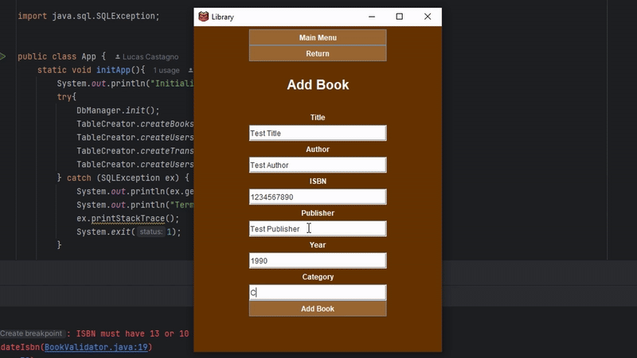

# LIBRARY 📙
### A desktop based library management system that allows users to add, remove, borrow and return books.
## Demo

#### Link to full video demonstration: https://youtu.be/v1fRQ9A8TMQ
### Disclaimer 
*This software was a didactic approach I've idealized as an aspiring software engineer. Its main goal was to learn more about Java JDBC, MySQL and Project Structuring, thus I've chosen not to delegate any part of this code to AI.*
## Features
- Login and Registration 
- 2 levels of permission (*librarian* and *member*)
- Add and Remove books (librarian only)
- Borrow books
- Visualize and Return books in possession
- Search books by ISBN code or Title 
## Stack
- Java with Swing/Awt for UI
- MySQL integration via JDBC for database
- jBCrypt for password encryption

